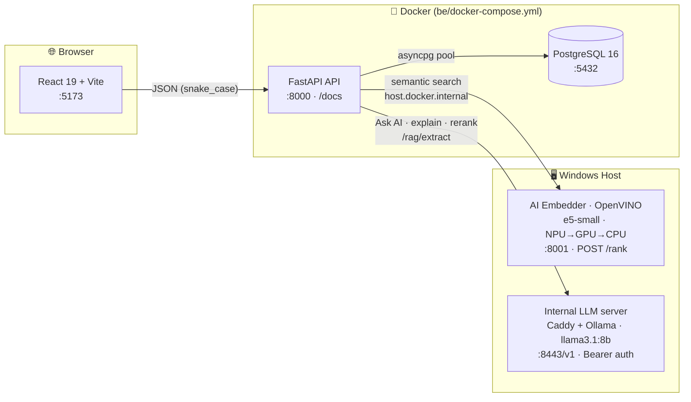

<div align="center">

# 🖥️ IT Ledger

**The system of record for company IT hardware — a calm, aurora-lit workspace where a tedious chore feels alive.**

Every device, its current owner, and its full maintenance & handover history — rolled up into a fleet dashboard, searchable in Vietnamese, and answerable by an on-prem AI assistant.

<br/>


</div>

---

## What & why

IT Ledger replaces scattered hardware spreadsheets with **one trustworthy source of record**. It serves two audiences inside one company: the **IT / ops team**, who register devices, log repairs, and record handovers daily (and need speed), and **team leads & managers**, who drop in occasionally to check fleet health without training.

A ledger only reports accurately if it's kept current — and it only stays current if using it isn't a burden. So IT Ledger's strategic wedge is **delight**: an asset tracker people don't dread opening, with fleet visibility that's readable at a glance.

---

## ✨ Highlights

- 📇 **Device inventory with a story** — each device carries its full owner, maintenance, and handover history, not just a current-state row.
- 📊 **Fleet dashboard** — KPI cards by status, brand/CPU/OS breakdowns, an activity feed, an aging watchlist (≥5 years old), and repair-spend rollups.
- 🔎 **Local semantic search** — an **offline embedding model on the Intel NPU** (no external API), ranking devices, maintenance, and handovers by meaning.
- 🇻🇳 **Bilingual by design** — English data is enriched with Vietnamese synonyms so a Vietnamese query matches same-language.
- 🤖 **Agentic "Ask AI"** — a cross-resource assistant grounded in exact fleet stats that calls backend tools and reads attached files (PDF / DOCX / XLSX / CSV / images).
- 🧠 **LLM rerank & explain** — optionally re-sort smart-search results and show *why* each result matched, learning project-locally from marked-correct feedback.
- 📥 **Import** — idempotent bulk import from xlsx/csv (skips existing serials).
- 🗑️ **Soft-delete & trash** — delete / restore / purge, plus bulk delete on every resource.
- 📄 **Paginated tables** — server-side sort / search / paginate / trash via a shared hook.
- 🎇 **Playful motion** — click sparkles, springy feedback, and a sliding nav indicator — always with a `prefers-reduced-motion` fallback (WCAG 2.1 AA).

---

## 🏗️ Architecture

Three runtimes cooperate. **Postgres + the API run in Docker**; the **AI embedder and the generative LLM run on the Windows host** — the embedder needs the Intel **NPU**, which a container can't reach. The Dockerized API reaches the host services via `host.docker.internal`.



> **Note:** `schema.sql` only runs on a fresh Postgres volume. After schema edits, recreate the DB: `docker compose down -v && docker compose up`.

---

## 🧩 Tech stack

| Layer | Tech | Notes |
| --- | --- | --- |
| **Backend** | FastAPI, uvicorn, asyncpg, Pydantic v2, httpx | Python 3.12. SQL lives only in `repositories/`; routers stay thin. |
| **Database** | PostgreSQL 16 | `unaccent` extension; soft-delete via `deleted_at`. |
| **Frontend** | React 19, Vite 8, TypeScript ~6, Ant Design 6, Tailwind 4 | chart.js + react-chartjs-2, anime.js, xlsx, react-router 7, react-toastify. |
| **Search** | multilingual-e5-small (ONNX) via OpenVINO | Runs on host, prefers Intel **NPU → GPU → CPU**. Embedding-only. |
| **LLM** | llama3.1:8b (OpenAI-compatible, on-prem) | Powers Ask AI / explain / rerank; called via raw `httpx` in `be/llm.py`. |

---

## 🚀 Getting started

**Prerequisites:** Docker, Node.js, Python 3.12.

**1 — Backend + database (Docker):**

```bash
cd be
cp .env.example .env      # set DATABASE_URL, LLM_BASE_URL, LLM_API_KEY (secret, gitignored)
docker compose up         # API on :8000 (Swagger at /docs), Postgres on :5432
```

**2 — Frontend + AI embedder (host):**

```bash
cd fe
npm install
npm run dev               # Vite (:5173) + the host AI embedder (:8001) together
```

**3 — Seed sample data (idempotent):**

```bash
python -m be.seed         # needs DATABASE_URL, or run inside the api container
```

**Other scripts:** `npm run build` (type-checks with `tsc -b`, then Vite build) · `npm run lint` (ESLint) · the AI service can run alone with `npm run dev:ai`.

Full local stack = `docker compose up` (DB + API) **plus** `npm run dev` (web + AI embedder). The LLM server is a separate internal-network endpoint.

---

## 📚 API reference

Base URL `http://localhost:8000`. JSON is **snake_case** both ways. Conventions: `?deleted=true` views trash · `?permanent=true` hard-deletes (purge) · `?rerank=true` on the three `semantic-search` routes re-sorts with the LLM.

**Devices** — `/devices`

| Method | Path | Purpose |
| --- | --- | --- |
| `POST` | `/devices` · `/devices/batch` | Create one / many |
| `POST` | `/devices/import` | Bulk import, skips existing serials |
| `GET` | `/devices` · `/devices/page` | List / paginated `{rows, total}` |
| `GET` | `/devices/search` · `/devices/filter` | Text search / field filter |
| `GET` | `/devices/semantic-search` | Ranked results (`score`, `document`, `reason`) |
| `GET`/`PATCH` | `/devices/{serial_number}` | Read / update |
| `POST` | `/devices/restore` | Restore from trash |
| `DELETE` | `/devices` · `/devices/batch` | Delete / bulk delete (`?permanent=`) |

**Maintenance** — `/maintenance` · **Handovers** — `/handovers`

| Method | Path | Purpose |
| --- | --- | --- |
| `POST` | `/{resource}` | Create |
| `GET` | `/{resource}` · `/{resource}/page` | List / paginated |
| `GET` | `/maintenance/search` | Text search (maintenance only) |
| `GET` | `/{resource}/semantic-search` | Ranked results |
| `GET`/`PATCH`/`DELETE` | `/{resource}/{id}` | Read / update / delete |
| `POST` | `/{resource}/{id}/restore` | Restore from trash |
| `DELETE` | `/{resource}/batch` | Bulk delete |

**Users** — `/users`

| Method | Path | Purpose |
| --- | --- | --- |
| `POST` | `/users` · `/users/batch` | Create one / many |
| `GET` | `/users` · `/users/search` | List / search |
| `GET`/`PATCH` | `/users/{employee_code}` | Read / update |
| `DELETE` | `/users` · `/users/batch` | Delete / bulk delete |

**Assistant** — `/assistant`

| Method | Path | Purpose |
| --- | --- | --- |
| `POST` | `/assistant/ask` | Agentic, cross-resource Q&A (multi-turn, reads files) |
| `POST` | `/assistant/explain` | "Why this result matched" one-liner |

**Feedback** — `/feedback`: `POST` (mark a result correct) · `GET` · `GET /feedback/stats`
**Meta**: `GET /health` (liveness) · `GET /healthz` (readiness — real DB round-trip)

---

## 🖼️ Screens

- **Dashboard** — fleet KPI cards, brand/CPU/OS pie charts, status bar chart, `ActivityFeed` (recent events), `AgingWatchlist` (devices ≥5 years old), and `RepairSpendPanel`.
- **Devices** — the master screen: table with smart search + relevance meter, the `DeviceJourneyPanel` and `RepairStoryPanel` telling each device's story, plus **Ask AI** (`AssistantModal`) and import.
- **Maintenance** — repair log with the smart-search + rerank + mark-correct toolset.
- **Handover** — who gave/received each device and why.

---

## 🗂️ Project layout

```
be/                 FastAPI backend (Python 3.12, asyncpg)
  main.py           App entry: lifespan (DB pool), CORS, router wiring, /health
  routers/          Thin HTTP layer — one module per resource
  repositories/     ALL SQL lives here (asyncpg $1,$2 placeholders)
  models/           Pydantic schemas (Create / Update / Out) per resource
  llm.py            Internal OpenAI-compatible client (chat / agent / rerank)
  search.py         Client for the ai /rank embedder
  documents.py      Row → bilingual sentence flatteners for search + assistant
  glossary.py       bilingualize(): append Vietnamese synonyms of IT terms
  sql/schema.sql    Table DDL · seed.py  Idempotent sample-data seeder
  docker-compose.yml  Postgres + API

ai/                 Local semantic-search embedder (runs on the HOST, NPU)
  main.py           FastAPI: POST /rank · OpenVINO on Intel NPU/GPU/CPU
  run-host.ps1      Launcher: creates .venv, uvicorn on :8001

fe/                 React 19 + Vite 8 + TypeScript
  src/api/          One module per resource; fetches go through client.ts
  src/components/   Screens (Dashboard, DeviceMainScreen, …) + Modal/
  src/lib/          format.ts, usePagedList.ts, sparkle.ts (anime.js), relevance.tsx
  src/types.ts      TS types mirroring the backend snake_case JSON
```

**Data model:** `users` (employee_code) → own `devices` (serial_number, specs, status) → which accrue `maintenance` (repair story + cost) and `handovers` (from/to + reason). Ownerless / in-stock devices belong to the ghost `IT-STORE` user. `search_feedback` stores marked-correct rows for project-local few-shot learning.

---

## 🎨 Design & product

IT Ledger is **"The Aurora Workspace"** — playful and delightful, resting on soft enterprise polish. A single periwinkle accent (`#7c74e8`) with a periwinkle→fuchsia aurora gradient reserved for signature moments (active nav, KPI numerals, primary CTA, the relevance meter). Inter throughout, frosted-glass panels, one glassy top nav (no sidebar) with an anime.js sliding indicator.

Core principles: **delight in a chore · story over cells · visibility at a glance · familiar affordances with personality · motion that always has a fallback.**

Deeper docs:

- 📌 [`PRODUCT.md`](./PRODUCT.md) — strategy, users, positioning, design principles
- 🎨 [`DESIGN.md`](./DESIGN.md) — the visual system (colors, type, components)
- 🛠️ [`CLAUDE.md`](./CLAUDE.md) — architecture & conventions for contributors
- 🤝 [`be/LLM_API.md`](./be/LLM_API.md) — the internal LLM/RAG server reference

---

<div align="center">
<sub>Built for the internal IT / ops team · an asset tracker people don't dread opening.</sub>
</div>
